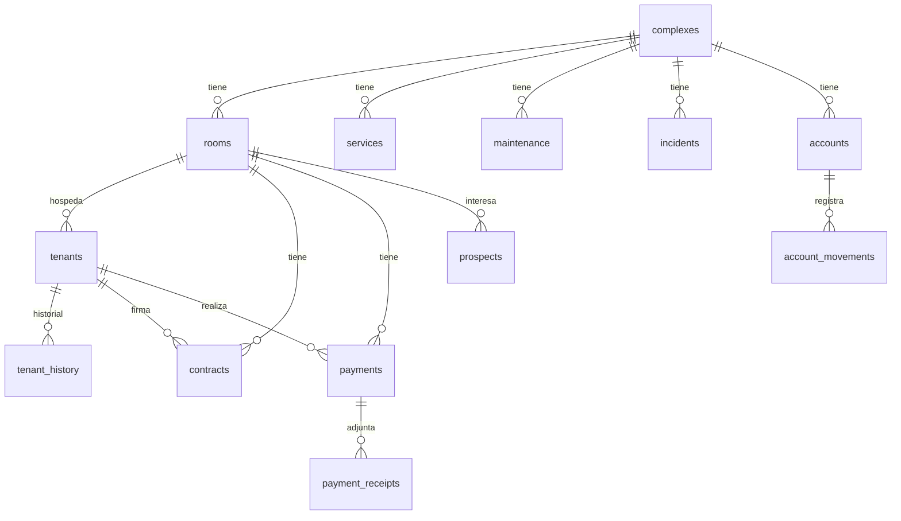

<div align="center">

# 🏠 Casitas

### Sistema de administración de propiedades en renta 🔑


🔗 **[casitas-sigma.vercel.app](https://casitas-sigma.vercel.app)**

</div>

---

## 📖 Sobre el proyecto

**Casitas** es una app para administrar propiedades en renta: complejos/edificios, cuartos, inquilinos, contratos, pagos, servicios, mantenimiento y más — todo en un solo lugar, con **Supabase** como backend.

---

## ✨ Funcionalidades (pantallas)

| Pantalla | Descripción |
|---|---|
| 📊 **Dashboard** | Vista general del estado de la operación |
| 🏢 **Complejos** | Edificios / propiedades administradas |
| 🚪 **Cuartos** | Habitaciones por complejo: renta, depósito, estatus, amenidades |
| 🧑‍🤝‍🧑 **Inquilinos** | Datos personales, contacto, contacto de emergencia, historial |
| 🔍 **Prospectos** | Interesados en rentar, visitas agendadas, seguimiento |
| 📄 **Contratos** | Vigencia, depósito, renovaciones, estatus |
| 💵 **Pagos** | Períodos, fechas límite, método, comprobantes |
| 🧾 **Servicios** | Luz, agua, gas, internet — proveedor, medidor, vencimientos |
| 🛠️ **Mantenimiento** | Tareas programadas, costo, responsable, estatus |
| 🚨 **Incidencias** | Reportes por prioridad y estatus |
| 📁 **Documentos** | Archivos relacionados a inquilinos, contratos, propiedades |
| 🏦 **Cuentas** | Bancarias y efectivo, con movimientos por complejo/cuarto |
| ⚙️ **Configuración** | Ajustes generales de la app |

---

## 🛠️ Stack tecnológico

<div align="center">

| Frontend | Backend | Deploy |
|:---:|:---:|:---:|
| 🌐 HTML5 + JS vanilla | 🟢 Supabase (PostgreSQL + REST) | ▲ Vercel |
| 🧩 Pantallas modulares (`.dc.html`) | 🔐 Row Level Security | |

</div>

---

## 🗄️ Modelo de datos



| Tabla | Propósito |
|---|---|
| `complexes` | 🏢 Propiedades / edificios |
| `rooms` | 🚪 Cuartos por complejo |
| `tenants` | 🧑‍🤝‍🧑 Inquilinos activos e históricos |
| `tenant_history` | 🕓 Historial de ocupación |
| `prospects` | 🔍 Interesados en rentar |
| `contracts` | 📄 Contratos de arrendamiento |
| `payments` / `payment_receipts` | 💵 Pagos y comprobantes |
| `services` | 🧾 Servicios contratados (luz, agua, etc.) |
| `maintenance` | 🛠️ Mantenimiento programado |
| `incidents` | 🚨 Incidencias reportadas |
| `documents` | 📁 Documentos relacionados |
| `accounts` / `account_movements` | 🏦 Cuentas y movimientos financieros |

> 🔐 RLS habilitado en todas las tablas. Actualmente con acceso completo para el rol `anon` — pendiente de restringir cuando se agregue autenticación real.

---

## 📂 Estructura del proyecto

```
Casitas/
├── index.html                     # 🔀 Redirige a Property Manager.dc.html
├── Property Manager.dc.html       # 🏠 Shell principal de la app
├── Screen*.dc.html                # 🖼️ Pantallas: Dashboard, Rooms, Tenants,
│                                  #    Contracts, Payments, Maintenance, etc.
├── AppModal.dc.html               # 🪟 Modal reutilizable
├── OnboardingTour.dc.html         # 👋 Tour de bienvenida
├── SearchPanel.dc.html            # 🔎 Panel de búsqueda global
├── data.js / sample-data.js       # 🗂️ Datos y datos de ejemplo
├── db.js                          # 🗄️ Capa de acceso a datos
├── supabase-client.js             # 🟢 Cliente Supabase (usar .example.js como plantilla)
├── supabase-schema.sql            # 🧱 Esquema completo de la base de datos
└── support.js                     # 🔧 Utilidades de soporte
```

---

## 🚀 Cómo correrlo localmente

```bash
# 1️⃣ Clona el repositorio
git clone https://github.com/AleSGlez/Casitas.git
cd Casitas

# 2️⃣ Configura tu cliente de Supabase
cp supabase-client.example.js supabase-client.js
# agrega tu URL y anon key del proyecto

# 3️⃣ Crea el esquema en Supabase
# Copia y corre supabase-schema.sql en el SQL Editor de tu proyecto

# 4️⃣ Sirve la app (cualquier servidor estático)
npx serve .
```

---

## 🔒 Notas de seguridad

- ⚠️ Las políticas actuales de RLS permiten acceso completo al rol `anon` — pensadas para una sola persona administrando, no como app multiusuario todavía.
- 🔑 Nunca subas `supabase-client.js` con tus llaves reales — usa `supabase-client.example.js` como plantilla y mantenlo fuera de git.

---

<div align="center">

Hecho con 🧡 por **Ale**

</div>
